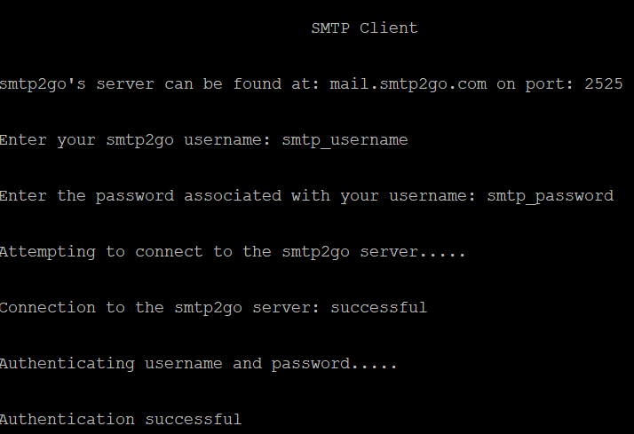
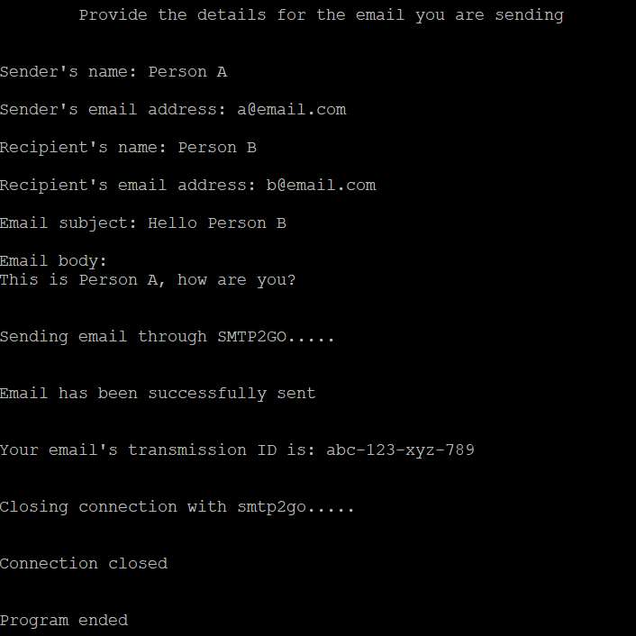

## SMTP Client

An SMTP client that utilizes [smtp2go](https://www.smtp2go.com/) as a email relay server


## Table of Contents

1. [Description](#description)
2. [Program Output](#program_output)
3. [Compile and Execute](#compile_and_execute)
4. [Function Headers](#function_headers)
5. [Structures](#structures)
6. [Other](#other)

## Description <a name="description"></a>

Simple Mail Transport Protocol (SMTP) is an email protocol used to send email messages.
This C based email client uses a TCP socket to connect to smtp2go.

Users can enter:
- Sender's name and email address
- Recipient's name and email address
- Email subject
- Email message

One email can be sent with each execution of this program.

**NOTE:**
You will need to make an account with smtp2go prior to using this program.

Once an account is made, add a SMTP User via the settings tab.

The username and password, used to create the user, will be the credentials you will use with the program.

## Program Output <a name="program_output"></a>




**NOTE:**

All information above is used for demonstration purposes only (i.e. not real credentials)

## Compile and Execute <a name="compile_and_execute"></a>

- Windows:

    To compile run the command `g++ *.cpp -o email_client`

    To execute run the command `email_client.exe`

- Linux / Mac

    To compile run the command `g++ *.cpp -o email_client`

    To execute run the command `./email_client`


## Function Headers <a name="function_headers"></a>

``` c
struct Account_info get_account_info(char smtp_server[], int smtp_port)
```

- Description:

    Get the smtp2go username and password from user

- Parameters:

    `char smtp_server[]` Represents hostname of smtp2go

    `int smtp_port` Represents port number used to connect to smtp2go

- Return:

    `struct Account_info` Struct containing username and password of smtp2go account

---

``` c
int connect_to_server(char smtp_server[], int smtp_port)
```

- Description:

    Makes connection to the smtp2go server

- Parameters:

    `char smtp_server[]` Represents the hostname of smtp2go

    `int smtp_port` Represents the port number to connect to smtp2go

- Return:

    `int` Represents the file descriptor of the TCP socket made when connecting

---

```c
char *base64_encode(char* data)
```

- Description:

	Base 64 encoding the sting passed to it
	Special thanks to this user for providing the details of this function: [source](https://stackoverflow.com/questions/342409/how-do-i-base64-encode-decode-in-c)

- Parameters:

	`char* data` Represents the string to be encoded

- Return:

	`char*` Represents base64 encoded string

---

```c
void authenticate_account(int sock_fd, char* encoded_username, char* encoded_password)
```

- Description:

	Authenticates username and password with the smtp2go server

- Parameters:

	`int sock_fd` TCP socket file descriptor used to connect to server

	`char* encoded_username` Base64 encoded username

	`char* encoded_password` Base64 encoded password


- Return:

	None

---


``` c
struct Email_info get_email_details()
```

- Description:

    Gets all information required to send email

- Parameters:

    None

- Return:

    `struct Email_info` Contains senders name and email address, recipients name and email address, email subject, and email body

---

```c
struct Email_commands format_commands(struct Email_info info)
```

- Description:

	Formats commands to send to the smtp2go server for email transmission

- Parameters:

	`struct Email_info info` Struct containing details of the email given by user

- Return:

	`struct Email_commands` Struct containing commands to be sent to the smtp2go server

---

```c
void send_commands(int sock_fd, struct Email_commands commands)
```

- Description:

	Writes commands to the smtp2go server and checks for successful acknowledgements from the server

- Parameters:

	`int sock_fd` TCP socket file descriptor used to connect to server

	`struct Email_commands commands` Struct containing commands to send to server

- Return:

	None

---


``` c
void close_connection(int sock_fd)
```

- Description:

    Closes TCP socket to smtp2go

- Parameters:

    `int sock_fd` TCP socket file descriptor used to connect to server

- Return:

    None


## Structures <a name="structures"></a>

``` c
struct Account_info
```

- Description:

    Holds username and password for smtp2go account

- Variables:

    `char username[_1BYTE]` Username for smtp2go account

    `char password[_1KB]` Password associated with username for smtp2go account

---

``` c
struct Email_info
```

- Description:

    Holds information needed to send email

- Variables:

    `char senders_name[EMAIL_SIZE]` Name of whos sending the email

    `char recipients_name[EMAIL_SIZE]` Name of whos recieving the email

    `char source[EMAIL_SIZE]` Email address of sender

    `char destination[EMAIL_SIZE]` Email address of recipients

    `char subject[SUBJECT_SIZE]` Emails subject

    `char body[BODY_SIZE]]` Emails body

---

``` c
struct Email_commands
```

- Description:

	Holds commands to be sent to smtp2go for sending email

- Variables:

	`char from_email[_1BYTE]` Tells server the source email address

	`char to_email[_1BYTE]` Tells server the destination email address

	`char data[_1BYTE]` Tells server that email data is being sent next

	`char from_name[_1BYTE]` Tells server the name of the person whos sending the email

	`char to_name[_1BYTE]` Tells server the name of the person whos receiving the email

	`char subject[_1BYTE]` Tells server the subject of the email

	`char body[BODY_SIZE]` Tells server the body of the email

## Other <a name="other"></a>

`EMAIL_SIZE 30` Max number of characters for senders name and email address, recipients name and email address

`SUBJECT_SIZE 50` Max number of characters for the subject of email

`BODY_SIZE 10000` Max number of characters for the body of email
